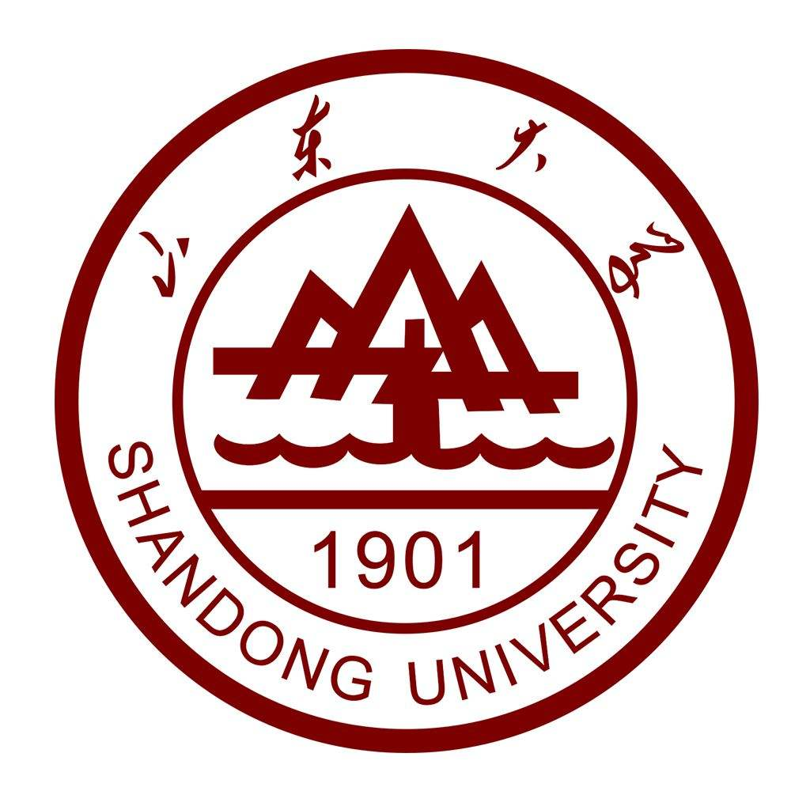
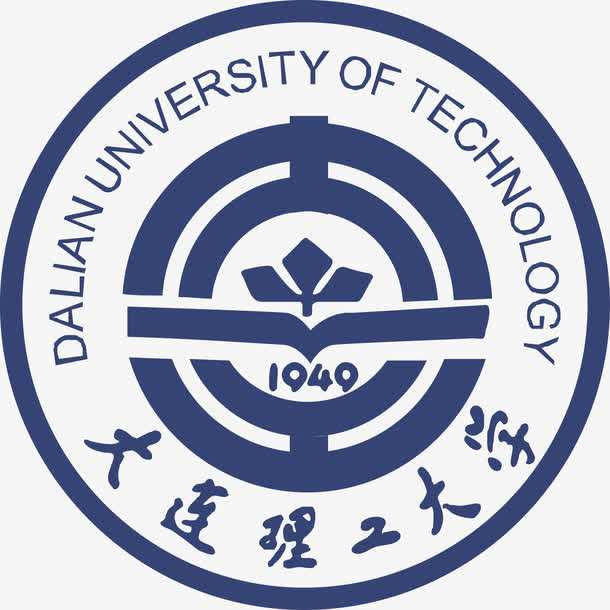
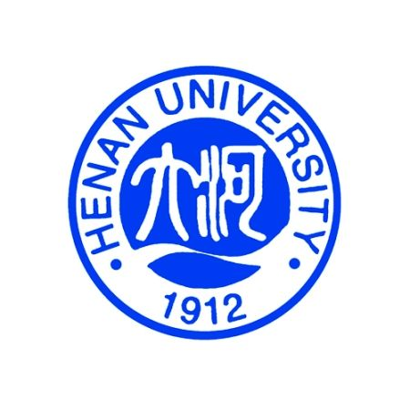
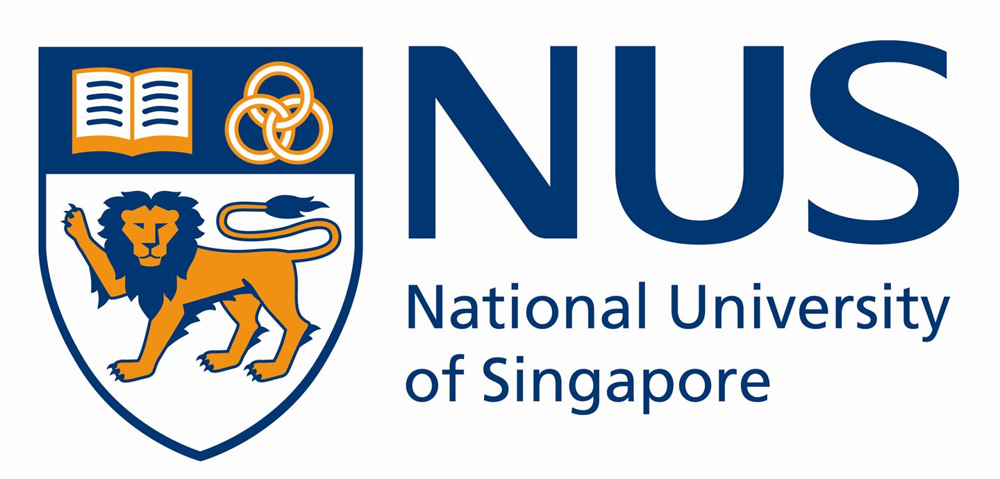

## About Me
I'm Meng Liu (刘萌), I currently a PhD student of Shandong University, Qingdao China, advised by [Prof. Baoquan Chen](https://cfcs.pku.edu.cn/baoquan/) and [Prof. Liqiang Nie](http://ir.sdu.edu.cn/~liqiangnie/index.html). My research focused on multimedia computing and information retrieval. I obtained my M.S. degree in computational mathematics from Dalian University of Technology, China, in 2016. I did internship at National University of Singapore from 2017 to 2018, advised by [Prof. Tat-Seng Chua](https://www.comp.nus.edu.sg/cs/bio/chuats/). 

## Education

        <strong> Shandong University, Qingdao, China (Sep 2016 - Dec 2019) </strong>
           
        <ul>
        <li>
          Doctor of Philosophy (Ph.D), Computer Science and Technology</li>
        <li>
          Advisor: Prof. Baoquan Chen and Prof. Liqiang Nie</li>
      </ul>      
      

        <strong> Dalian University of Technology, Dalian, China (Sep 2013 - Jun 2016) </strong>
          <a href="https://www.dlut.edu.cn/" target="_blank" rel="external">
            
          </a> 
        <ul>
        <li>
          Master of Science (M.S), Computational Mathematics</li>
        <li>
          Advisor: Prof. Xiuping Liu</li>
      </ul>      
      

      

        <strong> Henan University, Kaifeng, China (Sep 2009 - Jun 2013) </strong>
          <a href="http://www.henu.edu.cn/" target="_blank" rel="external">
            
          </a> 
        <ul>
        <li>
          Bachelor of Science (B.S), Mathematics and Applied Mathematics</li>
        <li>
          Graduated with Excellent Thesis Award</li>
      </ul>      
      

## Experience
     

        <strong> National University of Singapore, NUS, Singapore  (Oct 2017 - Oct 2018) </strong>
          <a target="_blank" rel="external">
            
          </a> 
        <ul>
        <li>
          Position: Research Intern, in NEXT++, School of Computing </li>
                
        <li>Cross-modal Moment Retrieval in videos via Language. </li>
      </ul>      
      

      
## Publications
**Jiyang Gao\***, Kan Chen\*, Ram Nevatia, "_CTAP: Complementary Temporal Action Proposal Generation_", European Conference on Computer Vision (**ECCV**), 2018 (\* indicates equal contribution)

**Jiyang Gao**, Ram Nevatia, "_Revisiting Temporal Modeling for Video-based Person ReID_", tech report, [arxiv](https://arxiv.org/pdf/1805.02104.pdf), [code](https://github.com/jiyanggao/Video-Person-ReID)

**Jiyang Gao\***, Runzhou Ge\*, Kan Chen, Ram Nevatia, "_Motion-Appearance Co-Memory Networks for Video Question Answering_", in IEEE Conference on Computer Vision and Pattern Recognition (**CVPR**), 2018, [arxiv](https://arxiv.org/pdf/1803.10906.pdf) (\* indicates equal contribution)

Kan Chen, **Jiyang Gao**, Ram Nevatia, "_Knowledge Aided Consistency for Weakly Supervised Phrase Grounding_", in IEEE Conference on Computer Vision and Pattern Recognition (**CVPR**), 2018, [arxiv](https://arxiv.org/pdf/1803.03879.pdf), [code](https://github.com/kanchen-usc/KAC-Net) 

**Jiyang Gao**, Zijian (James) Guo, Zhen Li, Ram Nevatia, "_Knowledge Concentration: Learning 100K Object Classifiers in a Single CNN_", tech report for the summer intern at Google Research, [arxiv](https://arxiv.org/abs/1711.07607)

**Jiyang Gao**, Chen Sun, Zhenheng Yang and Ram Nevatia, "_TALL: Temporal Activity Localization via Language Query_", in International Conference on Computer Vision (**ICCV**), 2017, **[Spotlight]**, [arxiv](https://arxiv.org/abs/1705.02101), [code](https://github.com/jiyanggao/TALL), [video](https://www.youtube.com/watch?v=ZDO064ccYS0)

**Jiyang Gao\***, Zhenheng Yang*, Kan Chen, Chen Sun and Ram Nevatia, "_TURN TAP: Temporal Unit Regression Network for Temporal Action Proposals_", in International Conference on Computer Vision (**ICCV**), 2017, [arxiv](https://arxiv.org/abs/1703.06189), [code](https://github.com/jiyanggao/TURN-TAP) (\* indicates equal contribution)

**Jiyang Gao**, Zhenheng Yang and Ram Nevatia, "_Cascaded Boundary Regression for Temporal Action Detection_", in British Machine Vision Conference (**BMVC**), 2017, [arxiv](https://arxiv.org/abs/1705.01180), [code](https://github.com/jiyanggao/CBR), [THUMOS-14 results](https://github.com/jiyanggao/CBR-results) 

**Jiyang Gao**, Zhenheng Yang and Ram Nevatia, "_RED: Reinforced Encoder-Decoder Network for Action Anticipation_", in British Machine Vision Conference (**BMVC**), 2017 **[Oral]**, [arxiv](https://arxiv.org/abs/1707.04818), [video](https://www.youtube.com/watch?v=wewtVcMzet0&t=6s)

Zhenheng Yang, **Jiyang Gao** and Ram Nevatia, "_Spatio-Temporal Action Detection with Cascade Proposal and Location Anticipation_", in British Machine Vision Conference (**BMVC**), 2017 **[Oral]**, [arxiv](https://arxiv.org/abs/1708.00042), [video](https://www.youtube.com/watch?v=oxPxY0aB4eI) 

**Jiyang Gao** and Ram Nevatia, “_Learning Action Concept Trees and Semantic Alignment Networks from Image-Description Data_” in Asian Conference on Computer Vision (**ACCV**), 2016 **[Oral]**, [arxiv](https://arxiv.org/abs/1609.02284)

**Jiyang Gao**, Chen Sun and Ram Nevatia, “_ACD: Action Concept Discovery from Image-Sentence Corpora_” in ACM International Conference on Multimedia Retrieval (**ACM ICMR**), 2016 **[Oral]**, [arxiv](https://arxiv.org/abs/1604.04784)

## Professional Services
Conference Reviewer for ACM MM'17, CVPR'18, ACCV'18, WACV'19, CVPR'19

Journal Reviewer for IEEE Transactions on Multimedia, IEEE Transactions on Cybernetics, Pattern Recognition and Computer Vision and Image Understanding (CVIU)

## Awards
Annenberg Graduate Fellowship at University of Southern California, 2015

Excellent Bachelor Thesis at Tsinghua University, 2015

Changhong Scholarship at Tsinghua University, 2014

First Prize of 31st “Challenge Cup” Student Academic Competition of Tsinghua University (as Team Leader), 2013

        <strong>This page has been visited for
           times</strong>
      

      
